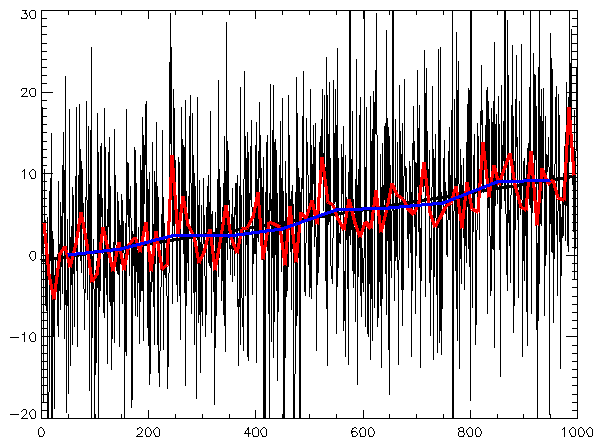

# Portfolio for Himanshu S
---
## Machine Learning

### Time Series Forecasting Project 

Time series forecasting involves predicting future values based on past observations. It's a critical technique in various fields, including finance, weather forecasting, and sales prediction.

